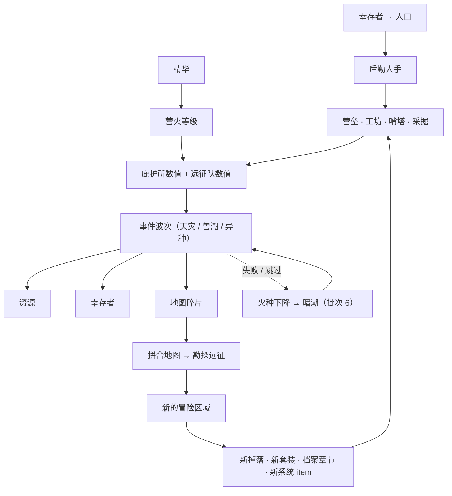

# 庇护所扩展方案

> 这份文档是【庇护所】这条线的**设计与实施依据**，和 `UI开发规范.md` 分工如下：
> - `UI开发规范.md` = **怎么写得不出 bug**（结构、约定、陷阱、勿回退清单）
> - 本文档 = **做什么、为什么这样做、按什么顺序做**（玩法设计、参数草案、路线图）
>
> 实现落地后，稳定的结构性约定（下标布局、奖励分发路径、修正层覆盖清单等）要**回写进 `UI开发规范.md`**，
> 本文档只保留设计意图与路线图。

---

## 0. 一句话概括

**庇护所不是【冒险】的配套，而是另一条并列的成长线，剧情上甚至更重要。**
玩法主轴是：**堆庇护所数值 → 扛住一波又一波事件 → 拿奖励（资源 / 幸存者 / 地图碎片）→ 解锁新的冒险区域 → 新的掉落与系统 → 再回来堆庇护所**。

---

## 1. 定位与命名

| 层级 | 名字 | 含义 |
| --- | --- | --- |
| 地点 | **庇护所**（Sanctuary） | 世界熄灭后最后有人聚集的地方 |
| 命脉 | **营火等级** | 庇护所的核心成长线，由**精华**升级；同时提升远征队与庇护所数值 |
| 势力 | **防线** | 由**工坊制造项**决定，用于抵御事件（营火与营垒修筑两条线都已移除，见 §4.3） |
| 外派 | **远征队** | 向外走的那部分人 |
| 人力 | **幸存者 → 人口** | 事件救下的人，转成后勤人手 |
| 刻度 | **波次** | 事件的可重复推进单位，3 次大事件为 1 波 |

**改名原则**：只改**显示文案**，`state.camp` / `.camp` / `.campWorkshop` 等**字段名一律保留**，存档格式零改动。
「营火」（那堆火本身）保留原词；「营垒修筑」这条线在批次 2 之后**整条移除**（理由见 §4.3 末尾）。

---

## 2. 设计决定记录

| # | 决定 | 结论 |
| --- | --- | --- |
| 1 | 火种 / 人口是否进顶部资源条 | **不进**。营火等级放庇护所页顶部；人口作为后勤人数的来源展示（后来庇护所页那格也撤了，只在工坊页那一行里看） |
| 2 | 挑战的形态 | **归零 + 独占目标**（不是重打同一套内容） |
| 3 | 改名是否动存档字段 | **只改文案**，字段全保留 |
| 4 | 区域解锁方式 | **不局限于一种**：可组合的规则（主线 / 地图 / 事件 / Boss / 挑战 / 任意组合） |
| 5 | `state.workshop`（原「营火强化」）遗留 | ~~方案 A：做成正式的**营火等级**入口~~ → **后来整条撤掉了**，见 §4.3：该字段只剩物品栏容量一处引用 |
| 6 | 波次粒度 | **3 次大事件 = 1 波** |
| 7 | 稀有度能不能两套同色 | **可以**（2026-09-18）：核心套 → 白 1、熔火套 → 蓝 2、Boss 独占 → 蓝 2，见 §10.2 |
| 8 | Boss 要不要「机制」（阶段弹窗一类） | **不要，只有肉搏**：难度全靠身板与数值；原 §4.8 的阶段弹窗整条撤出批次 3 |
| 10 | 特性（trait）还要不要 | **不要门槛、只留效果**（2026-09-18）：`requires` / `immune` 与两处倍率整条移除；【破甲】改成「攻击时无视固定防御」，对所有怪生效并写进详情 |
| 11 | Boss 三档按什么校准 | **全极致深井套 + 三种强化物打满**（攻 114 / 防 56 / 血 582，2026-09-18）：常规 86% / 强化 126% / 绝境 176%（台阶刻意拉陡），见 §8 |
| 12 | 【隔热】怎么办 | **给它一个减伤效果**（2026-09-18）：受到的伤害 −15%，对所有敌人生效、写进详情。⚠️ 两条特性各在一件上，**遗锋不带特性**（纯数值 + 可成长） |
| 13 | 遗锋的取向与设定 | **均衡取向**（2026-09-18）：1 阶 0 精炼 = **攻 5 / 血 5 / 防 5**，靠阶与精炼长大（满配 30/30/30）。设定：**一件遗落在这个世界的神兵，能量散尽** —— 名字与描述都不带 Boss 的痕迹 |
| 14 | 阶要不要显示在面板上 | **不显示**（2026-09-18）：详情 / 图鉴 / 卡片三处都不写「第几阶」，只靠数值变化体现（同 R36 的「不给提示」） |
| 15 | 军事训练怎么派人 | **工坊同款**（2026-09-18）：每项技能一个后勤位、派人 + 材料够就自动开工、练完自动接续、**可以同时练几项**；原「一次一项 + 待命 ≥ 2 的门槛」作废 |
| 16 | 技能要不要等级上限 | **不要上限**（2026-09-18）：坡度由成本（×1.35/级）与总工时（×1.15/级）撑着，练到哪一级是「投不投得起」的问题 |
| 17 | 打穿最难形态的奖励 | **成就「Boss 征服者」→ 饰品槽 +1**（2026-09-18）：判据 = 任意一只 Boss 的**最后一档**（`difficulty` 全清），槽位数由 `getEquipSlotCounts()` 现算 |
| 9 | 2-4「击碎熔核」的奖励 | **解锁手动模式 + 研究基地「军事训练」页签**，见 §4.12 |

> 5 和 6 是实施时采用的默认值（提出时未收到明确选择），如有异议直接改本文档与对应配置。

### 一条贯穿性的设计原则

> **不引入没有出口的资源。**
>
> 反面教材就在项目里：**精华（余烬碎片）** 能掉、能奖励、在资源条上显示，但**没有任何地方花掉它**。
> 所以：
> - 批次 1 让营火等级**消耗精华** ⇒ 顺便把这个洞补上；
> - **「火种」推迟到它有出口时（批次 2 的科技树）再引入** —— 否则只是再造一个精华；
> - 地图碎片在**合成功能就绪之前不发**。

---

## 3. 核心循环



每一环都必须有**出口**：数值有地方花、奖励有地方用、区域解锁条件看得见。

---

## 4. 系统设计

### 4.1 事件与波次

**现状问题**：`getNextCampChallenge()` 的判定是 `disasterWins < 1` / `tideWins < 1`，各打赢一次后永远 `return null`；
而 `campEventStats()` 里的成长公式（`180 + wins * 140`、`9 + wins * 5`）本来是给「可重复挑战」准备的，`wins` 永远停在 1 ⇒ **成长公式是死代码**。

**改法**：

```
wave = 当前波次（新增字段）
每 3 次大事件 = 1 波；第 3 次是「波末」
每波内交替：天灾 → 兽潮 → 异种（天灾/兽潮的变体，按 wave 决定名字与描述）
```

- `getNextCampChallenge()`：不再是「各一次就 null」，而是按 `wave` 与已通过次数算出**现在该打哪一场**
- `campEventStats()`：线性外推换成**分档非线性**（见 §8 参数草案），否则二十几波之后数值会失控
- 事件种类从「天灾 / 兽潮两个」扩成**三个**：新增 **异种**（`CAMP_EVENT.mutant = 3`），它是每波的收尾，数值在天灾与兽潮之上
- 事件定义表从「按下标排的数组」改成**按 kind 取的 Record** —— 中间留不留空位都不影响取值（`random` 走另一张表）
- **三者不做内容差异化**：`config/events.ts` 里只留 name / icon / desc，没有 advice，
  **也不进图鉴**（图鉴的分类页只收随机事件，显示名叫「随机事件」）；游戏内「当前威胁」卡片的标题
  直接显示事件名，不跳图鉴 —— 见 §8 末尾
- 波末额外奖励（幸存者 ×3 基准）
- **第一波的门槛靠数值，不靠门控**：原来的基准太软（天灾 180/9/3 时裸庇护所剩 90 血就赢），
  现在抬到「裸庇护所一场都打不过、要先在冒险里攒资源升基础城防」那一档（实测对照见 `UI开发规范.md` §7.16）。
  曾经试过加「主线推到第 5 步才能迎战」的门控，**已撤掉**：那既挡了玩家自己攒资源的节奏，
  也让城防 / 弩台这两条花钱的成长线失去意义 —— **要它难就抬数值**

**新增 kind 的注意**：`CAMP_EVENT` 的取值是**存档字段**（`pendingKind`），只能**追加**，不能重排。
`campEventEntries`（图鉴条目表）也一样 —— 条目 id 是从它的下标算出来的，新条目**追加到末尾**。


### 4.2 奖励类型

`campEventStats().rewards` 现在只有 `{ gold, scrap, essence }`，扩成：

| 奖励 | 来源 | 用途 | 批次 |
| --- | --- | --- | --- |
| 资源（金币 / 废料 / 精华） | 所有事件 | 工坊 / 研究 / 强化 | 已有 |
| **幸存者** | 救援类事件、波末 | → 人口 → 后勤人手 | **1 已完成** |
| **地图碎片** | 大事件（按事件类型分套）；随机事件补最靠前的缺口 | 凑齐 → 拼图 → 勘探远征 → 解锁区域 | **2 已完成** |
| **系统 item** | 波末 → 剧情任务奖励 | 解锁新工坊制造项 / 研究项 | **已完成**：做成远征档案**第二章「余烬之外」**里的几节 —— 条件提前可见、奖励是图纸、**拿到手还要用掉它（付资源 / 解读线索）才解锁**，见 §4.11 |
| 火种 | 硬仗 | 庇护所科技树货币 | 3+ |

### 4.3 营火等级 —— ❌ 已移除

曾经实现过「花**精华**提升营火等级，同时抬高远征队与庇护所」，**后来按需求整条撤掉了**：
`FIRE` 常量、四个函数（`getFireLevel` / `getFireCost` / `canUpgradeFire` / `upgradeFire`）、
庇护所页顶部那一块，全部删除。留下三条结论：

- **六个 getter 回到「基础 + 装备 / 套装 / 词条 / 工坊」**，不再有任何「全局等级」项。
  以后要加成长线请独立新增，别再借道 `state.workshop`
- **`state.workshop` 成了遗留字段**：新存档恒为 0、只有老存档带旧值，现在**只剩
  `getInventoryCapacity()`（`20 + 等级 × 2`）一处引用**。要不要彻底删掉 = 「老存档那几十格要不要留」，待定
- **精华重新变成「只进不出」** —— 它原来的唯一出口就是营火。要补出口时优先给它一个新的系统，
  而不是再造一个中间货币（§2 的原则）

**「营垒修筑」也已整条移除**（批次 2 之后）：它是一条**不花材料**的成长通道 —— 把待命后勤投进去，
按工时每 100 换 1 级营垒，直接加庇护所生命 / 攻击 / 防御 / 恢复，造价为零、也没有上限。
结果是玩家在主线「组建第二支小队」「追踪核心信号」之前就能把第一波天灾 / 兽潮硬堆过去，
那两节的战力奖励（哨戒弩台 / 研究项「信号放大」）形同虚设。

- 现在庇护所**只能靠工坊制造项**变强（`CAMP_BASE + workshopBonus`），而制造项要**花材料**（金币 / 废料 / 装甲板），
  推进节奏因此由资源说了算，也就自然被主线牵着走
- 后勤人手**只投向制造项**（`fortSlot`）。`logistics.assigned` 的 0 号位留着占位（删掉会让旧存档的
  城防 / 弩台人手错位），`syncLogistics()` 每次都会把它清成 0、把人释放回待命
- `camp.worksiteProgress` 成了遗留字段：不再写、不再读，也不参与任何数值（同 `state.workshop` 的处理）
- 大事件**没有**加主线门控：玩家可以在主线「组建第二支小队」「追踪核心信号」之前就去试着打，
  但那时候城防不够、打不过 —— 「顺序」是靠数值自然形成的，见 §4.1

### 4.4 地图碎片 → 地图 → 勘探远征（批次 2）—— ✅ 已实现

- 碎片做成**物品**（`category: 'resource'`，可堆叠）⇒ 自动进物品栏、自动进图鉴、可掉落可奖励
- 碎片**按事件类型分套**（每套 3 片）：天灾 / 兽潮 / 异种各一套。一波里三种事件依次出现，
  所以想集齐一套就得把三种都打下来 —— 刷同一种没用。
  （原案写的是「按区域分套」，落地时改成按事件分套：这样「逼玩家打不同类型的事件」才是真的成立）
- 残片带坐标，凑齐后在 UI 上**拼成一张地图**（纯 CSS grid，视觉爽点，零战斗成本）——
  落地成**研究基地里的「勘探图」页签**：面板上只有**三格槽位**，点一格从物品栏里挑一片放进去，
  三格必须是同一张图的残片（`pages/research.ts`）→ 见 §4.5 之后的实施备注
- 拼好之后**不是直接解锁**，而是开启一次**勘探远征**（限时 10 分钟：派人去，成功才解锁）⇒ 多一层张力，
  也让「庇护所派人出去」这件事有画面。**失败不扣残片**，可以立刻再派一次；残片在成功那一刻才消耗
- 新增配置表：`mapSets`（残片物品下标 + 拼图坐标 + 由哪种事件产出）；哪张图解锁哪个区域写在
  区域表的 `unlock: unlockBy.map(...)` 里 —— 避免 `maps ↔ zones` 互相引用成环
- 三张图分别指向：余烬矿脉（天灾碎片）、核心深井（兽潮碎片）、**熔火裂谷**（异种碎片，新区域）
- **兜底**：随机事件也会补一片（补最靠前的缺口）。随机事件每小时一次、与波次无关，
  给卡在某一波的玩家留一条靠时间慢慢磨的路

### 4.5 区域解锁规则（批次 2）—— ✅ 已实现

原状：`Zone.unlockIndex` 单一通道，判定集中在 `isZoneUnlocked()`（**全游戏唯一判定点**）。

现在是**可组合规则**，并且复用主线条件那套 `{ text, done }` 形状 —— 这样图鉴的「进入条件」与解锁公告
两处**都自动学会显示**，不用各写一套（冒险页原来那行解锁提示已删除，见 `UI开发规范.md` §7.15）：

```ts
/** 区域解锁规则：和主线条件同一套形状，渲染直接复用主线那套。 */
export interface UnlockRule {
  text: (state: GameState) => string;      // 渲染层 HTML，可内嵌图鉴引用
  done: (state: GameState) => boolean;
  notice?: string | (() => string);        // 解锁提示的补语；不写 = 开局就满足 ⇒ 不进提示列表
}

export const unlockBy = {
  mainline: (index: number) => UnlockRule,   // ✅ 已实现
  map:      (mapId: number) => UnlockRule,   // ✅ 已实现
  all:      (...rules: UnlockRule[]) => UnlockRule,  // ✅ 已实现
  any:      (...rules: UnlockRule[]) => UnlockRule,  // ✅ 已实现
  wave:     (n: number) => UnlockRule,       // ✅ 已实现：扛过第 n 波（读 camp.wave）
  mainlineDone: () => UnlockRule,            // ✅ 已实现：第一章全通（章节门控用的就是它）
  chapter:  (chapter: number, node: number) => UnlockRule  // ✅ 已实现：做完某一章某一节（章 / 节都从 1 起）
};
```

**`event` / `boss` / `challenge` 不在这里** —— 它们各自的依赖都不在这一批，别挂在这一批上等：
`boss(enemyId)` 归**批次 3**（§4.6：它要先有「每只怪被打过几次」的记录字段）；`challenge(id)` 归**批次 4**（§4.9）；
`event(kind, count)` 没有任何依赖（三种胜场计数已经在存档里），**要用的时候再加**，不挂任何批次。

当前的实际配置：

| 区域 | 规则 | 含义 |
| --- | --- | --- |
| 庇护所 / 废弃边境 | `mainline(0)` | 开局 |
| 余烬矿脉 | `map(veinChart)` | **只能靠勘探图**：天灾掉矿脉图纸，勘探成功才开 |
| 核心深井 | `map(deepProfile)` | **只能靠勘探图**：兽潮掉深井剖面，勘探成功才开 |
| **熔火裂谷**（新） | `map(riftChart)` | **只能靠勘探图** |

> **配套要求（不是可选项）**：每种规则都必须给出可读的 `text()`，否则玩家不知道该去哪。
>
> **实现注意**：主线节点名要靠**注入**（`setMainlineTitles`）拿 —— `config` 不能反向 import `game-state`，
> 否则 `zones → unlock → game-state` 成环。细节见 `UI开发规范.md` §7.17。

### 4.6 Boss 区域（批次 3）

> ✅ **已落地**（2026-09-18）：第 3 节「穿过裂谷」的奖励换成了真解锁（区域「熔核之扉」的 `unlock` 就是 `unlockBy.chapter(2, 3)`），
> 并追加了第 4 节「击碎熔核」（条件 = 击败常规难度一次，奖励是 §4.12 的手动模式与军事训练）。

**风格**：Boss 是前三个区域的东西在裂谷尽头汇聚成的**同一个实体** —— 矿脉的结晶（骨）、深井的核心信号（神经）、
裂谷的地热（血）。**没有机制，只有肉搏**：不做阶段、不做弹窗、不改规则，只有一副比玩家高一档的身板。
（原计划的「阶段弹窗」已整条撤出本批，见 §4.8。）

- `Zone` 加 `kind: 'combat' | 'boss' | 'camp'`、`spawnCooldown`（**复活计时**：击杀之后才生效；进场用全局的 3 秒；**换难度**只在场上那只未被击败时用全局的 3 秒 —— 换档把它作废重刷；已击败的情形只改档位、不碰刷新计时）、`difficulties`
- **三档 = 逐档全面更强**（2026-09-18 改）：生命 / 攻击 / 防御单调上升、出手越来越快 ——
  原来那版「三种体态、生命倒着排」（常规 900 → 强化 800 → 绝境 760）越高档越脆，读起来就是错的
- **数值刻意拉高**：常规按「**全极致深井套 + 锐化油 / 生命之种 / 铁壁涂层打满**」校准
  （攻 114 / 防 56 / 血 582 / 回复 2 / 间隔 2.2，见 §8），一场打掉约 **86%** 生命 —— 一场一条命；
  绝境按这份基准也过不去：它要的是【破甲】+ 更多精炼 / 词条 / §4.12 的手动技能

| 难度 | 战斗数值（§8） | 掉落 |
| --- | --- | --- |
| 常规 | 生命 2700 / 攻 79 / 防 30 / 间隔 2.6 | 通用 + 1 件独占（饰品，带【破甲】） |
| 强化 | 生命 2900 / 攻 90 / 防 40 / 间隔 2.4 | 通用 + 另 1 件独占（饰品，带【破甲】） |
| 绝境 | 生命 3200 / 攻 100 / 防 45 / 间隔 2.2 | 通用 + **可成长饰品**（1→9 阶、**不带特性**，见 §4.13） |

- 实现：`DropEntry` 加 `tier?: number`（缺省 = 所有难度都掉）。
  **安全性**：存档里 `discoveredDrops[enemyId]` 存的是**物品下标**，不是掉落条目下标
  ⇒ `dropTable` 的内部结构可以自由扩展，**不影响存档**（`zones.ts` 顶部「键顺序不能动」只约束怪物表/区域表本身）。
- **`unlockBy.boss(enemyId)` 在这一批落地**：它要先有「某只怪被打过几次」的记录 ——
  现有状态里只有 `zoneWins`（按区域）与 `encountered`（布尔），所以**新增字段**（`rebuildState` 补默认值，不动 `SAVE_VERSION`），
  在击败敌人时自增。⚠️ `text()` 要写 Boss 的名字，而 `unlock.ts` 不能 import `game-state`
  ⇒ 名字靠注入（照 `setMainlineTitles` 的做法）或放 config 侧。
- **独占件一律做成饰品**（饰品有 2 格，放第二格）⇒ 不拆套装；稀有度统一**蓝色（2）**
- 三档的「已通关」要**分别记录**（2-4 的条件是「击败**常规**难度一次」）⇒ 位掩码字段，见 §10

### 4.7 特性（trait）：从「门槛」改成「装备效果」（2026-09-18 改）

原设计是「没带某条特性就受伤 ×2.5 / 伤害 ÷3」的门槛 —— **整条移除**：
只有肉搏的 Boss 不该变成「翻包找钥匙」。现在的口径：

- `Item.traits?: string[]` 保留，但它是**装备自己的效果**，对所有怪物生效
- **唯一有效果的是【破甲】**：`playerAttack` 里 `armor = hasTrait('piercing') ? 0 : enemy.defense`（无视固定防御）。
  判定仍然只有 `hasTrait()` 一处（扫身上装备的实例 → 物品定义）
- 删掉的东西：`Enemy.requires` / `ZoneDifficulty.requires` / `ZoneDifficulty.immune` 两个字段、
  两处伤害倍率、战斗卡片那行 `.requirement`、图鉴怪物页的「特性需求」段
- 显示：装备详情与图鉴物品页写「**破甲（攻击时无视敌人的固定防御）**」—— 效果说明必须跟着名字，
  只给名字玩家看不出它做了什么（浮层里只能用 phrasing 元素，见 §7.7）
- 【隔热】`insulated` = **受到的伤害 −15%**（2026-09-18 拍板）：对所有敌人生效，写在 `enemyAttack` 里；
  数值放 `TRAIT_EFFECT` 一处，详情与图鉴的文案跟着它生成
- ⚠️ **两条特性各在一件上**：裂甲锥 = 破甲、熔壳护芯 = 隔热；**遗锋不带任何特性** ——
  它的取向是纯数值 + 可成长（§4.13），别把特性塞回去（那是原「门槛链」的遗留，门槛已整条移除）
- `sonar` 声呐本批**不出物品**（没有敌人需要它）—— 留给批次 5 的无声之海 / 齿轮深渊
- **难度改由数值承担**：三档逐档全面更强（§4.6 / §8），防御越高的档【破甲】越值钱
  （常规 → 强化：带与不带，有效伤害差 65%）

### 4.8 挂起与弹窗输入 —— ❌ 已撤出批次 3

**撤掉的理由**：Boss 的口径是「没有机制，只有肉搏」（§4.6），阶段弹窗与它冲突；撑起这一批玩法的是
§4.12 的**手动模式与技能**，不是「中途答题」。下面保留的是当时的设计记录 —— 要重做时按它走
（`state.prompt` 的通用化、`install` 的 `input` 形态、批次 5 的无声之海都会用到它）。

**代码里已有现成模式** —— 庇护所随机事件的「挂起等待响应」：

```ts
target.camp.pendingKind = CAMP_EVENT.random;
target.camp.pendingId = id;
target.camp.pendingExpires = Date.now() + PENDING_EVENT_TIMEOUT * 1000;
```

把它**通用化**（**新增** `state.prompt`，老字段 `camp.pending*` 保持不动以免破坏存档），Boss 就能在中途拦住玩家：

```ts
Enemy.phases?: [
  { hpPct: .75, prompt: { mode: 'choice', ... } },   // 选择：硬扛 / 绕后 / 撤退
  { hpPct: .40, prompt: { mode: 'input',  ... } }    // 输入：从战斗日志里读出的信号序列
]
```

`input` 型的公平性：**线索就写在战斗日志里**（Boss 报出一串信号），玩家在日志中找出来填进去
⇒ 把「读日志」本身变成玩法，而不是考记忆力。

**放置游戏的护栏（必须遵守）**：
- 只在 Boss 区域触发
- 每场战斗最多 1~2 次
- 超时自动按**最坏结果**处理
- **设置页可整体关闭**（关掉 = 一律自动按「不回答」处理）

### 4.9 远征档案的【挑战】（批次 4）

**形态**：归零 + 独占目标。

- 目标复用主线条件那套 `{ text, done }` ⇒ 挑战页直接复用 `story.ts` 的条件渲染，不另写一套
- 「归零」的实现：集中一层 `challengeFactor()`，套在所有派生数值外面
- **必须逐个覆盖**：
  `getPlayerAttack` / `getPlayerDefense` / `getPlayerMaxHp` / `getPlayerRegen` / `getPlayerAttackInterval`
  + `getCampMaxHp` / `getCampAttack` / `getCampDefense` / `getCampRegen`
  + `getLogisticsTotal` + `getWorkshopRate`
  —— **漏一个就会出现「挑战里还能作弊」**
- 结果记进**新增字段**（不动老字段），并给成就 / 图鉴条目 / 专属物品
- **`unlockBy.challenge(id)` 在这一批落地** —— 它要读的 `camp.challengeCleared` 随这一批新增

| 挑战 | 限制 | 玩法变化 |
| --- | --- | --- |
| 赤手 | 装备与词条全部失效 | 逼你靠庇护所数值打 |
| 孤火 | 庇护所加成归零 | 必须在挑战内靠事件奖励重新堆起来 |
| 静默 | 随机事件不能跳过、没有前兆 | 不能挑食 |
| 无声 | 后勤人数恒为 1 | 人手分配变成真正的取舍 |
| 焦土 | 生命恢复为 0 | 每次战斗都要算 |
| 盲行 | 看不到敌人数值，只能读日志 | 回到「读文字」的原始体验 |
| 限时 | 必须在 N 次事件内达成目标 | 节奏压力 |

**为什么这块性价比最高**：给已通关玩家准备、**复用现有全部系统**、只换一组参数。

### 4.10 多元宇宙与小世界（批次 5）

**世界观**：击败核心深处的新 Boss → 激活余烬核心 → **时空乱流** → 后续区域进入多个小世界。

- `Zone` 加 `world?: number`，新增 `worlds` 配置表（名字 / 图标 / 主题色 / 描述）
- 每个小世界**自带一套装备**（现有 `setTable` 本来就是「一套一区域」）
- 远征档案的章节结构**已经是两级**（chapter → nodes），第二章占位已写好（`story.ts` 的 `chapters`）⇒ 加世界章节不用改结构
- 图鉴可按世界分组（`ITEM_PAGE` 那套分类页是现成模式）

| 小世界 | 风格 | 专属机制 |
| --- | --- | --- |
| 锈红沙漠 | 蝗灾式 | 单只很弱，但每次刷一片 |
| 镜像城 | 镜像数值 | 怪物复制玩家属性 ⇒ 逼你别一味堆攻 |
| 无声之海 | 弹窗 + 输入 | Boss 全靠阶段弹窗 |
| 齿轮深渊 | ~~特性检查~~ | **作废**（2026-09-18）：门槛特性（`requires` / `immune`）已整条移除 —— 这一区以后按「效果型特性」另议 |
| 静谧森林 | 无战斗 | 只有资源交换与时间推进 |
| 熔炉回廊 | 只出强化道具 | 掉落池被换成纯强化材料 |

### 4.11 波末「系统 item」→ 剧情任务（批次 2 收尾）—— ⚠️ 这一版**已整章推翻重做**（2026-09-17）

> **现状**：这条线（剧情任务 + 安装浮层 + 两件系统物品）因为节奏失控被整章删除，
> 第二章已按「区域探索 + Boss」重做 —— **以 `UI开发规范.md` §7.19 为准**，下面保留的是当时的实施记录。
> 章节的两条铁律也变了：**章内严格顺序推进**（不再是「每节各自独立、谁先做都行」）、
> **没轮到的节一律 `???`**（不再给未达成的节露出解锁条件）。

原案是「波末直接掉一个物品，拿到就解锁对应的制造项 / 研究项」。实施时改成两处：

1. **写进远征档案的章节树，做成第二章「余烬之外」里的几节**：达成之前不剧透、达成后才显形，
   玩家不会"打着打着突然解锁"。**不单开页签**（那会和「主线剧情」重复），
   也**不进 `mainline` 数组**（那条数组按下标存进存档，插节点会挪动既有下标）——
   两种节并列挂在同一棵树上：第一章顺序推进，第二章每节条件各自独立。
   章节按顺序开放（第二章要等第一章全部完成才出现），章内的节一律全部列出、用 done / current / unlock 三态区分。
2. **拿到 ≠ 解锁，还要"用掉它"**：奖励是一件图纸（消耗品），右键「使用」会开出安装浮层，
   走完那种形态才算装上、对应项才出现。取消 = 什么都没发生。

```
条件达成（checkQuests 每帧检查）→ 图纸自动进物品栏 → 右键「使用」→ 安装浮层
  → installQuest()：扣代价、图纸用掉、任务转「已安装」→ 工坊项 / 研究项出现
```

**安装形态是可插拔的**（这是这一版最要紧的部分）：`QuestInstall` 是一个可辨识联合，
每种形态 = 一个联合分支 + `src/install.ts` 一个渲染分支 + 样式一个块；结算只认
「代价够不够 + 形态的答案对不对」，所以 `installQuest()` 与任务表都不用动。

| 形态 | 玩法 | 已实现 |
| --- | --- | --- |
| `pay` | 单纯支付资源（金币 / 废料 / 装甲板），不够就点不动 | ✅「哨塔蓝图」→ 工坊「哨戒弩台」 |
| `choice` | 解读线索：谜面 + 选项，答错原地重试、无惩罚 | ✅「测绘仪零件」→ 研究项「勘探仪」（+5% 勘探成功率 / 级） |
| `input` / 多步 / 信号序列 | 从战斗日志里读出的信号串（§4.8 的那套）等 | **推迟**：它需要「可挂起的 `state.prompt`」，而 §4.8 已随「Boss 纯肉搏」撤出批次 3 —— 要重做时按 §4.8 的记录走 |

**两条护栏**（写进 `UI开发规范.md` §7.19）：

- **老存档不回退**：既有条目加渠道一律 `unlockBy.any(原条件, unlockBy.quest(id))`，
  不能换成只留任务 —— 已经造到几级的弩台不能在工坊里凭空消失。
- **谜题公平性**：线索与答案都要能从**浮层里给出的信息**推出来，不依赖游戏外的知识、
  记忆或跨页查找；答错不消耗、可无限重试。

**稀有度**：系统物品用新增的第 17 档**靛蓝色**（排在琥珀色＝任务物品之后，见 `UI开发规范.md` §4.2）。

---

### 4.12 手动模式与军事训练（批次 3）

**手动模式**是 2-4 的奖励。解锁后冒险页工具栏下方出现一块战斗控制区（3 行 4 列）：
第一列是「自动 / 手动」切换按钮，右侧 3×3 是技能槽位 —— 第一排攻击、第二排防御、第三排辅助。

- 自动模式 = 现在的逻辑（玩家侧按出手间隔自动出手）；手动模式 = **玩家侧不再自动出手**，改为点技能槽位触发，
  敌人照常按自己的间隔出手（「挂机也会挨打」这条不变）
- 技能各有冷却；切回自动立刻恢复自动出手。**手动模式的价值在技能与节奏，不是更快的普攻**
  （普通攻击的冷却就是出手间隔，手动不会比自动更快）—— 否则自动模式会被淘汰
- 技能表 9 项，**只有【普通攻击】开局已解锁**，其余 8 项占位（锁定 + `???`，解锁方式待定）

**军事训练**是研究基地的第三个页签（委托 / 勘探图 / 军事训练），与手动模式同一个门槛。

- 内容 = 9 项技能的等级与效果。**派遣后勤人手 + 消耗资源**换等级 —— 与工坊制造**同一套工时模型**
  （每个技能一个后勤位 `drillSlot`、派人 → 攒工时 → +1 级、练完自动接续；**可以同时练几项**，人手是唯一的闸）
- **高成本极低增长**：成本随等级陡增、总工时随级递增，而效果每级只加一点点 —— 它是长期目标，不是速成
- ⚠️ 训练**不吃**「勤务」词条（那条写的是工坊工时）：基础产出固定 1 工时/人/秒

### 4.13 可成长饰品（批次 3）

「整个游戏少数」的饰品：**初始一阶，最高九阶**。

- 每阶提高它的自身属性（阶系数见 §8）
- **升华**：精炼到极致（+100）之后，右键菜单才会多出「升华（这是什么？）」—— 点击 = 阶 +1，**精炼清零**
- **设定**（2026-09-18）：它是「**一件遗落在这个世界的神兵利器，能量已经散尽**」——
  所以名字（**遗锋**）与描述都不带 Boss 的痕迹，掉落只是它出现的方式
- ⚠️ **不给任何提示**：物品描述、图鉴、帮助、公告都不写「可成长 / 升华」；玩家只有把一件喂到极致才会看见那个按钮
- ⚠️ **阶不在界面上显示**：详情 / 图鉴 / 卡片都不写「第几阶」（原来详情里跟过一个 `.stage-tag`，已撤）——
  成长只从数值上看出来
  这是刻意留的「自己发现」，所有写文案的地方一个都别碰
- ⚠️ **不可撤销**：升华会清掉那 100 级精炼的投入（要不要二次确认见 §9）
- 全游戏第一件就是第一个 Boss 的**绝境**独占（§4.6），做成饰品（放第二格，不拆套装）

---

## 5. 实施路线图

| 批次 | 内容 | 状态 |
| --- | --- | --- |
| **0 地基** | 改名【庇护所】（只改文案）+ `UI开发规范.md` 补 §7.16 | **已完成** |
| **1 立起来** | 事件波次化（新增异种）+ 奖励加「幸存者」+ 人口进后勤 + 庇护所页展示 | **已完成**（营火等级曾一并做过，随后被撤掉，见 §4.3） |
| **2 向外扩** | 地图碎片 / 地图 / 勘探远征 + 解锁规则多样化 + 一张新区域 + **10 只怪重新校准** + 波末「系统 item」 | **已完成**（勘探图见 §4.4 / §4.5；`UI开发规范.md` 补 §7.17 / §7.19。**波末「系统 item」那一项后来整章推翻**、改做第二章「愈深之处」，见 §4.11） |
| **3 Boss** | Boss 区域（三档体态 / 独占掉落 / 特性链）+ 可成长饰品 + **手动模式与军事训练**（2-4 的奖励）+ `unlockBy.boss` + 稀有度降档 | **已实现**（2026-09-18；数值与手感待实际游玩校准，口径见 §10） |
| **4 通关内容** | 远征档案【挑战】（归零 + 独占目标）+ `unlockBy.challenge` | 待做 |
| **5 世界扩张** | 多元宇宙：世界表 + **一个小世界打通全链路** | 待做 |
| **6 加厚度** | 前兆 / 守望塔 / 多阶段 / 交涉 / 暗潮 / 口粮 / 拼图 UI | 待做 |

**批次 5 的硬性约束**：**先做一个小世界打通全链路**（区域 + 5 只怪 + 套装 + 掉落 + 图鉴 + 章节），
验证完再做第二个。每加一个区域的工作量是**乘数级**的，不要一次铺开。

---

## 6. 技术落点

| 要做的事 | 挂在哪 | 新增字段 | 风险 |
| --- | --- | --- | --- |
| 改名 | `index.html` 导航 + 全部文案 | 无 | 文案清扫量大，**单独提交** |
| 营火等级 | `state.workshop`（复用）+ 庇护所页 | 无 | 做完要重新校准 10 只怪 |
| 事件波次 | `getNextCampChallenge()` + `campEventStats()` | `camp.wave` | 小 |
| 奖励多样化 | `campEventStats().rewards` + `finishCampBattle()` | — | 小 |
| 人口进后勤 | `getLogisticsTotal()` + 工坊页来源拆分 | `camp.population` | 小 |
| 碎片 / 地图 | 新物品 + `mapSets` 配置表 + 「勘探图」（研究基地的页签） | `camp.maps` / `camp.expedition*` | 中（已完成） |
| 区域解锁 | `isZoneUnlocked()`（唯一判定点）+ `Zone.unlock` + `config/unlock.ts` | — | 小，但要配 `text()`（已完成） |
| 新区域 | `zones.ts` 末尾追加 + 5 只怪 + 一套装备 + 任务物品 | — | 中（已完成，见 §8） |
| Boss 区域 | `Zone.kind / spawnCooldown / difficulties` + `DropEntry.tier` | — | 中 |
| 特性检查 | `enemyAttack()` / `playerAttack()` + `Item.traits` / `Enemy.requires` | — | 小 |
| 手动模式与技能 | 冒险页战斗控制区（3×4）+ `config/skills.ts` | `state.skills` / `adventure.manual` / `adventure.skillTimers` | 中 |
| 军事训练 | 研究基地第三页签 + 派遣式训练（每项一个后勤位 + 工时结算，同工坊） | `state.drills` | 中 |
| 可成长饰品 | `Item.growth` + `EquipmentInstance.stage` + 升华动作 + 右键菜单按钮 | `stage` | 中，⚠️ 全程不提「升华」 |
| 稀有度降档 | `config/items.ts` 的 rarity（核心 → 白 1、熔火 → 蓝 2）+ `config/rarity.ts` 与 `UI开发规范.md` §4.2 的说明表 | — | 小，纯颜色 |
| 挑战 | 集中 `challengeFactor()` | `camp.challengeCleared` | 中，覆盖清单见 §4.9 |

### 三条硬约束

1. **下标不能动**：怪物表 / 区域表 / 物品表都是按下标存进存档的（`zones.ts` 顶部 ⚠️ 已写明）。
   新怪物、新区域、新物品**一律追加末尾**。
2. **`CAMP_EVENT` 的取值只能追加**（它是 `pendingKind` 的存档值）。
3. **老字段不移动、不重命名**；要新概念就**新增**字段。新增字段不动 `SAVE_VERSION`（走 `rebuildState` 的逐字段校验）。

---

## 7. 风险与护栏

| 风险 | 护栏 |
| --- | --- |
| Boss 难度 × 独占掉落导致物品 / 图鉴爆炸 | 每个 Boss **三档各 1 件**独占（第 1 个 Boss 就是 3 件），且是「不同取向」不是「更强」 |
| ~~弹窗 + 输入破坏放置体验~~ | **作废**：Boss 已改成纯肉搏，阶段弹窗整条撤出批次 3（§4.8） |
| 手动模式 + 技能把放置游戏改成「必须一直点」 | 自动模式仍是默认与主玩法；手动只是多一种打法（技能 / 节奏），挂机风险如实写在帮助里 |
| 小世界数量膨胀 | 先做一个打通全链路（见 §5） |
| 解锁方式多样化后玩家不知道去哪 | 每种规则必须给可读 `text()`，三处显示 |
| 挑战「归零」漏掉某个 getter | 用 §4.9 的覆盖清单逐个勾 |
| 新增资源没有出口 | §2 的「不引入没有出口的资源」原则 |
| 数值失控 | §8 的参数**都要标注「待调」**，校准前不要写死结论 |
| 手动模式让自动变成「更差的选择」 | 手动只多技能与节奏：普攻冷却 = 出手间隔，自动仍是默认模式 |
| 技能数值失控 | 「高成本极低增长」：成本陡增、时长递增、每级效果只一点点（§8 全部待调） |
| 隐藏机制被文案剧透 | 「升华」只存在于那个按钮上：描述 / 图鉴 / 帮助 / 公告一个字都不写 |
| Boss 拉高数值后常规也过不去 | 三档走**分档体态**（不是乘系数），常规按「熔火套齐」复算过（§8） |
| 特性件挤掉套装效果 | 三件独占一律饰品（第二格），不碰熔火之核那一格 |

---

## 8. 参数草案（全部待调）

> ⚠️ 这一节的数字都是**按现有基准推的初值，没有经过实际游玩验证**。
> 调之前先读 `config/zones.ts` 顶部那段「数值设计的三条约束」。

**营火等级 —— 已移除**，参数不再适用。它留下的缺口（**余烬矿脉 / 核心深井这 10 只怪是按一条
已经删掉的成长线设计的**）在批次 2 已经补上，走的是「按实际基准降怪」那条路：

> 四档区域一律按「**穿齐上一区域的整套套装**」重算，净损失压在生命上限的 **25~35%**
> （一条命能连打三场左右）。核心泰坦作为终点怪刻意留高一档（约 39%）。
> 完整基准表在 `config/zones.ts` 文件头与 `UI开发规范.md` §7.6。

**勘探远征**（`EXPEDITION`，全部可调）

| 项 | 现值 | 说明 |
| --- | --- | --- |
| 时长 | 10 分钟 | 看时间戳结算，离线也照常走完 |
| 出发门槛 | 待命后勤 ≥ 2 人 | 「派人去」的语义；**不占用**后勤分配 |
| 成功率 | 基础 55% + 每名待命后勤 7%，上限 95% | 出发时锁定，途中招人不改这一趟 |
| 失败 | 地图退回「待勘探」 | 只损失时间，可以立刻再派 |

> 先这么摆着，等实际玩过再调：时长太短会让「派人出去」没有分量，太长（比如挂机一小时才回来）
> 又会让这块在放置节奏里失去存在感。成功率的意义是让「多留点待命人手」有回报。

**波次强度**（`wave` 从 1 起）

| 项 | 现值 |
| --- | --- |
| 事件生命 / 攻击 | 第 1 波基准值 × `CAMP_WAVE.growth^(wave-1)`，**growth = 1.35** |
| 事件防御 | 基准值 `+ (wave-1) × CAMP_WAVE.defenseStep`（**线性**，见下） |
| 出手间隔 | 前 3 波不变，之后每波 `-0.03`（下限 0.7） |
| 奖励 | 基准值 × `scale^CAMP_WAVE.rewardDamp`（`rewardDamp = 0.5`） |
| 波内结构 | 天灾 → 兽潮 → 异种（异种是波末） |

> **为什么这次是等比**：这是**刻意**要的那堵墙 —— 庇护所侧是线性成长（工坊制造项的造价与工时随级数
> 线性涨、没有上限），等比迟早在某个波次追上。于是「能推到第几波」成为长期目标，
> 也顺手掐掉了「一路平推」导致的进度失控。
>
> **为什么防御走线性**：防御进的是减法（伤害 = 攻击 − 防御，最低 1 点）。跟着等比会让伤害迅速压到 1 点，
> 把「打不过」变成「磨不完」—— 那是另一种崩坏。
>
> **奖励只跟涨平方根那一档**：全额跟涨会让金币 / 废料 / 精华的数值爆炸，完全不跟涨又没人愿意往上推。
>
> **`growth` 决定墙在哪**（庇护所固定为攻 93 / 防 114 / 血 1575 时的实测 —— 这组数值现在只能由
> **工坊制造项**堆出来，营垒那条线已移除）：
>
> | growth | 可清剿场次 | 推到约 |
> | --- | --- | --- |
> | ×1.12 | 62 | 第 21 波 |
> | ×1.15 | 50 | 第 17 波 |
> | ×1.20 | 40 | 第 14 波 |
> | ×1.25 | 32 | 第 11 波 |
> | ×1.30 | 29 | 第 10 波 |
> | **×1.35**（现值） | 25 | 第 9 波 |
> | ×1.45 | 20 | 第 7 波 |
> | ×1.60 | 17 | 第 6 波 |

**三种大事件不进图鉴**：它们只差属性，所以 `config/events.ts` 里只留 name / icon / desc（没有 advice），
`campEventEntries` **只收随机事件** —— 图鉴那个分类页就叫「随机事件」。
（曾经试过给三者合并一页「威胁」，后来按需求撤掉了：Threat 只看属性，不需要图鉴页面。）

**人口**

| 项 | 草案 |
| --- | --- |
| 每人手 | 3 人 ⇒ `getLogisticsTotal` 加 `⌊人口 / 3⌋` |
| 来源 | 救援类事件、波末 |
| 展示 | 工坊页「待命 X / 总数 Y（主线 N / 胜场 N / 人口 N）」那一行（庇护所页原来那格已撤） |

**第一个 Boss「熔核守卫」的三档**（区域「熔核之扉」；2026-09-18 重排）

校准基准 =「**全极致深井套 + 锐化油 / 生命之种 / 铁壁涂层打满**」
＝ 攻 114 / 防 56 / 血 582 / 回复 2 / 间隔 2.2（2-3「穿过裂谷」要 6000 杀，刷完就是这个身板）

| 难度 | 生命 | 攻击 | 防御 | 间隔 | 基准净损失 | 金币 |
| --- | --- | --- | --- | --- | --- | --- |
| 常规 | 2700 | 79 | 30 | 2.6 | **86%**（33 下 / 约 73 秒 / 净损失 501） | 550 |
| 强化 | 3000 | 94 | 42 | 2.4 | **126%**（基准 + 裂甲锥；**不带【破甲】时 223%**，必死） | 750 |
| 绝境 | 3200 | 100 | 48 | 2.2 | **176%**（基准 + 裂甲锥；要过它得再堆到 攻 ≈140 / 血 ≈750） | 1000 |

> 复算口径同 §7.6：`N = ⌈Boss生命 ÷（玩家攻击 − Boss防御）⌉`、`T = N × 2.2`、
> `受伤 = ⌈T ÷ Boss间隔⌉ ×（Boss攻击 − 玩家防御）`、`净损失 = 受伤 − 2T`（回复 2/s）。
> ⚠️ **敌人的攻击必须显著高于基准防御（56）**：防御进减法，原来那组 26~30 打在这份身板上只剩个位数伤害 ——
> 这就是「Boss 数值太低」的根源，换数值时先跑一遍上面的复算。
> ⚠️ 三档**逐档全面更强**（生命 / 攻击 / 防御单调上升、间隔越来越短）；门槛特性已移除（§4.7），
> 难度只由数值与【破甲】承担；金币按「击杀变慢、每秒产出大致不变」折算（同 §7.6）。

**军事训练**（`MILITARY`，全部待调）

| 项 | 现值 | 说明 |
| --- | --- | --- |
| 派遣 | 每个技能一个后勤位（`drillSlot`） | 与工坊同构：派人 → 攒工时 → +1 级；**可以同时练几项**，人手是唯一的闸 |
| 总工时 | `30 分钟 × 1.15^等级`（人·秒） | 1 个人就是 30 分钟、两个人 15 分钟；不吃「勤务」加成 |
| 成本 | 金币 4000 / 废料 1200 / 装甲板 60 × `1.35^等级` | 开工时扣（自动接续时会一级一级接着扣），不退款 |
| 效果 | 每级 +1.5% 伤害（**没有等级上限**） | 「高成本极低增长」：投入陡增、收益一点点；坡度全靠成本与工时 |

**已实现的技能**（`config/skills.ts`，其余 7 格仍是占位）

| 槽位 | 技能 | 冷却 | 效果 |
| --- | --- | --- | --- |
| 0（攻击 1） | 【普通攻击】 | 跟随出手间隔 | 一次普通攻击（`攻击 − 敌防`，【破甲】可无视防御），每级 +1.5% 伤害 |
| 3（防御 1） | 【格挡】 | 10 秒 | **3 秒窗口**：窗口内受到的**下一记**伤害 −`20% + 每级 0.1%`（**300 级之后每级只按 1/10 计**，上限 90%），挨完即消耗；超时白用 |

> 格挡的数值只有 `BLOCK` / `blockCut()` 一处（卡片与结算共用）；窗口存 `adventure.blockTimer`（秒，随 tick 递减，脱战也走）。

**升华（可成长饰品）**

| 项 | 现值 | 说明 |
| --- | --- | --- |
| 阶系数 | 自身属性 ×`(1 + (阶-1) × 0.25)` | **基础值 攻 5 / 血 5 / 防 5**（均衡）；9 阶 = ×3，再乘满精炼 ×2 ⇒ **30/30/30** |
| 升华条件 | 精炼 = 100（【极致】）且 阶 < 9 | 右键菜单才出现那个按钮 |
| 代价 | 阶 +1、**精炼清零** | 不可撤销；**无需二次确认**（按钮本身就是动作，2026-09-18） |

---

## 9. 待定问题

| # | 问题 | 当前假设 |
| --- | --- | --- |
| 1 | ~~营火等级用精华还是新资源~~ | **作废**：营火已整条移除（§4.3），精华暂时又没有出口了 |
| 2 | 波次粒度 | **3 次大事件 = 1 波** |
| 3 | ~~营火等级上限与曲线~~ | **作废**：同上 |
| 4 | 波次强度曲线 | **已定：等比 `×1.35^(wave-1)`**（防御线性、奖励跟涨平方根），见 §8 |
| 5 | 「异种」是独立 kind 还是天灾/兽潮的档位 | **独立 kind**（`CAMP_EVENT.mutant = 3`，追加在末尾不影响老取值） |
| 6 | 地图碎片每套几片 | **已定：3 片**（3 张图 × 3 片 = 9 个碎片物品，见 §4.4） |
| 7 | 挑战的具体数量与顺序 | 批次 4 定 |
| 8 | 碎片按区域分套还是按事件分套 | **已定：按事件分套**（天灾 / 兽潮 / 异种各一套）—— 这样才能真正做到「逼玩家打不同类型的事件」；随机事件补最靠前的缺口作为兜底 |
| 9 | 系统物品要做几种安装形态 | **先做两种**（`pay` 付资源 / `choice` 解读线索），机制可插拔（见 §4.11）。⚠️ 原计划的 `input`（从战斗日志里读信号序列）本来是等批次 3 的 `state.prompt` 通用化 —— **那条已随阶段弹窗整条撤出**（§4.8），要用 `input` 时重新设计 |
| 10 | 第一波（天灾 / 兽潮）的强度 | **已定（批次 2 后校准）**：`CAMP_EVENT_BASE` 抬到「裸庇护所打不过、城防 2/3/5 级才分别稳过天灾 / 兽潮 / 异种」（对照表在 `UI开发规范.md` §7.16）。营垒修筑同时整条移除。后续若还嫌软，下一档杠杆是 `workshopItems[0]` 的 `perDefense`（防御进减法，每 +2 就少吃一大截）或再抬基准值 |
| 11 | 稀有度能不能两套同色 | **已定：可以**（用户口径）。核心套 → 白 1、熔火套 → 蓝 2、Boss 独占 → 蓝 2；稀有度只是色彩档，不是进度刻度 |
| 12 | 「升华」要不要二次确认 | **不要**（2026-09-18 拍板）：按钮本身就是动作；不可逆，但玩家是有意点的 |
| 13 | 其余 7 项技能的解锁方式与效果 | **占位**：目前落了【普通攻击】与【格挡】（2026-09-18），其余 7 格锁定 + `???`，解锁方式后面单独定 |
| 14 | 军事训练能不能取消 / 退款 | **不能退款**（改为工坊同构之后依然如此）：开工即扣资源；把人撤下来只是进度停住，已投入的工时留着 |
| 15 | `sonar` 声呐什么时候上 | 批次 5（无声之海 / 齿轮深渊）；本批**不产出**带它的物品 |

---

## 10. 批次 3 实施方案（Boss · 特性 · 手动模式）

> §4.6 / §4.7 / §4.12 / §4.13 写的是**设计意图**，这一节写**落地口径**：先定内容，再列数据、代码落点、顺序与护栏。
> 数值一律**待调**（同 §8 的口径）；带 ⚠️ 的是「必须按这个走」的硬结论。
> **口径变化（2026-09-18 重定）**：① Boss 纯肉搏 ⇒ 原「阶段弹窗 / `state.prompt`」整条撤出（§4.8 已标注）；
> ② 2-4 的奖励改成**手动模式 + 军事训练**；③ 核心 / 熔火套各降一档，Boss 独占统一蓝色（2）；
> ④ 只有**绝境**那件独占做成可成长饰品。

### 10.1 交付清单

| 线 | 交付内容 | 主要落点 |
| --- | --- | --- |
| A 稀有度降档 | 核心套 → 白 1、熔火套 → 蓝 2；Boss 独占 → 蓝 2 | `config/items.ts` / `config/rarity.ts` / `UI开发规范.md` §4.2 |
| B Boss 区域 | 「熔核之扉」（`kind: 'boss'`）+ 三档体态 + 刷怪冷却 + 三件独占 | `types.ts` / `config/zones.ts` / `game-state.ts` |
| C 特性 | `Item.traits` +【破甲】无视固定防御（门槛与倍率已移除，2026-09-18）+ 装备详情 / 图鉴 | `types.ts` / `config/traits.ts` / `game-state.ts` / `wiki.ts` / `pages/inventory.ts` |
| D 可成长饰品 | 阶 1→9 + 升华（极致后出现、清精炼）+ 右键菜单 | `types.ts` / `game-state.ts` / `pages/inventory.ts` |
| E 手动模式 | 冒险页战斗控制区（3×4）+ 技能释放 / 冷却 / 模式切换 | `types.ts` / `game-state.ts` / `pages/adventure.ts` / `style.css` |
| F 军事训练 | 研究基地第三页签 + 派遣式训练（每项一个后勤位 / 工时模型 / 自动接续） | `config/skills.ts` / `game-state.ts` / `pages/research.ts` / `shop-card.ts` |
| G 进度接回 | 2-3 奖励改真 + 追加 2-4 + `unlockBy.boss` + 提示 / 帮助 / 公告 | `game-state.ts` / `pages/story.ts` / `config/help.ts` / `config/changelog.ts` |

### 10.2 稀有度降档（先做，纯颜色）

| 内容 | 现在 | 改成 |
| --- | --- | --- |
| 废弃边境装备 | 灰（0） | 不变 |
| 余烬矿脉装备 | 白（1） | 不变 |
| 核心深井装备 | 蓝（2） | **白（1）** |
| 熔火裂谷装备 | 绿（3） | **蓝（2）** |
| Boss 独占（三件） | — | **蓝（2）** |
| 特殊渠道（清洗剂 / 地图碎片 14、任务物品 15、系统物品 16） | 14 / 15 / 16 | 不变 |

- ⚠️ 稀有度**只影响物品名颜色**，不参与任何数值：纯数据改动，不用重算平衡
- ⚠️ **允许两套同色**（已定；见 §9-11）：稀有度不是进度刻度，只是色彩档 —— 余烬与核心同为白、熔火与 Boss 独占同为蓝
- 同步改三处说明：`config/items.ts` 的注释、`config/rarity.ts` 的档位分配表、`UI开发规范.md` §4.2 的表

### 10.3 Boss 区域与三档体态

| 项 | 值（待调） |
| --- | --- |
| 区域名 | **熔核之扉**（icon `🌑`）—— 第二章第 3 节说的「一扇门」 |
| Boss | **熔核守卫**（art `核`，与名字首字错开）—— 前三个区域的元素汇聚体：结晶为骨、核心信号为神经、地热为血 |
| 解锁 | `unlockBy.chapter(2, 3)`：第 3 节「穿过裂谷」的奖励改成真解锁 |
| 复活计时 | **60 秒**（普通区域 3 秒）：**击杀之后**才等这么久 —— 有喘息与回血（野外 2/s ⇒ 回 120），也避免独占件被刷爆。⚠️ **进入区域 / 换难度不走它**，用全局的 3 秒（否则每次进门都要干等一场复活）；界面上的环形进度按「这一轮的总时长」画 |
| 换难度的刷新 | 场上那只还站着（未被击败）⇒ 换档把它作废、走**全局** 3 秒才有下一只；已经打死（复活计时中）⇒ 只改档位，不重刷也不动计时 |

三档（数值见 §8；**逐档全面更强**，不是同一只怪乘系数；**没有门槛特性**了）：

| 难度 | 独占掉落（每档 1 件，都是饰品） |
| --- | --- |
| 常规 | 「裂甲锥」（带【破甲】：攻击时无视固定防御） |
| 强化 | 「熔壳护芯」（带【隔热】：受到的伤害 −15%） |
| 绝境 | 「遗锋」（**可成长饰品** 1→9 阶、**不带特性**：纯数值取向，见 §4.13） |

- **独占件走 `dropTable`**（`DropEntry.tier`）：Boss 掉落表**允许超过 3 条** —— 「同一只怪最多 3 条」是为了不稀释普通怪的期望产出，Boss 是逐档解锁的收集位，不受它约束（图鉴掉落表本来就按单列渲染）
- ⚠️ **难度切换不会把半血那只带进新档**：场上那只未被击败的换档即作废、等全局刷怪冷却才有下一只（换档不是免费的即时刷新）；已击败的情形只改档位、不碰计时。难度存 `adventure.difficulty`
- ⚠️ 「已通关难度」必须**分别记录**：2-4 的条件是「击败**常规**难度一次」⇒ `state.bossClears[enemyId]` 位掩码（第 n 位 = 第 n 档已通关），与 `enemyWins`（总击败数）分开

### 10.4 特性检查（唯一入口）

**① 派生只有一个入口**（本批最容易踩的坑）

```
getBattleEnemy(target)        // 也可让 currentEnemy() 直接返回这个视图
  = 敌人表原值 + 当前区域 / 难度的体态值（生命 / 攻击 / 防御 / 间隔）
```

- `prepareEnemy`（起始生命）、`playerAttack`（防御）、`enemyAttack`（攻击）、`getEnemyAttackInterval`、冒险页卡片**全部改读它** —— 漏一处就是「界面显示一档、实际打另一档」

**② 特性 = 装备效果（唯一判定点 `hasTrait()`，2026-09-18 改）**

```ts
hasTrait(trait, target)   // 扫 equipped 里所有实例的 itemId → items[itemId].traits
伤害 = max(1, 攻 − 防)     // 唯一的用处：armor = hasTrait('piercing') ? 0 : enemy.defense
```

- 门槛那套（受伤 ×2.5 / 伤害 ÷3）**整条移除**：敌人身上不再有 requires / immune，界面上也没有需求行
- 别把特性写进装备属性 / getter 里 —— 那会连带污染卡片显示与工坊计算（R34）
- 显示：装备详情与图鉴物品页写「破甲（攻击时无视敌人的固定防御）」，**不新增界面元素**

**③ 掉落档位**：`grantDrops` 里加一行 `(drop.tier ?? 0) === 当前难度档` 才判定；套装 / 任务物品 / 清洗剂三条通道不受影响（`discoveredDrops` 存物品下标，不受 `dropTable` 结构变化影响）。

**④ `unlockBy.boss(enemyId)`**：判定就是 `enemyWins[enemyId] >= 1`。`text()` 要写 Boss 名字，而 `unlock.ts` 不能引 `game-state`（也不宜引 `zones`：`zones → unlock` 会成环）⇒ **照 `setMainlineTitles` 的做法注入** `setEnemyNames(id => name)`。本批 2-4 的条件直接读 `bossClears`，`boss()` 留给后续区域用。

### 10.5 可成长饰品（升华）

- 数据：`Item.growth?: { maxStage: number }`（静态表）+ `EquipmentInstance.stage`（缺省 1，进存档）
- 属性：`自身属性 = 基础值 × (1 + (阶 − 1) × 0.25)`，与精炼相乘（§8）
- 动作 `ascendEquipment(instanceId)`：条件是「有 `growth` + 精炼 = 100 + 阶 < 9」⇒ 阶 +1、精炼清零
- 界面：`pages/inventory.ts` 的右键菜单（`actionsFor()`）**只在极致时**多出一项，文案就是**「升华（这是什么？）」**；点击直接升华（无二次确认，见 §9-12）
- ⚠️ **四处文案一个字都不能提**：物品描述、图鉴物品页、帮助浮层、更新公告（连「可成长」都不写）
- ⚠️ `perfectItems`（曾达到极致的记录）**不受影响**：升华清的是精炼等级，不是「达成过」的成就记录

### 10.6 手动模式（冒险页战斗控制区）

| 项 | 规则 |
| --- | --- |
| 解锁 | 完成 2-4（`unlockBy.chapter(2, 4)`）；未解锁**整块不渲染**（R29） |
| 版式 | 3 行 4 列：第 1 列是「自动 / 手动」切换（跨 3 行），第 2~4 列是 3×3 技能槽（行 = 攻击 / 防御 / 辅助） |
| 槽位 | 图标 + 名称 + 冷却遮罩；未解锁 = 锁 + `???`（不剧透名字） |
| 切换 | 状态存 `adventure.manual`；自动模式下所有槽位 `disabled` |
| 手动战斗 | 玩家侧**不再自动出手**（`advanceAdventure` 跳过玩家计时），敌人照常出手 |
| 释放 | `useSkill(slot)` → 校验（手动模式 / 已解锁 / CD 已好 / 场上有敌人）→ 结算 → 进 CD |
| 冷却 | 每项技能各自的 `cooldown`；【普通攻击】= 出手间隔（手动不会比自动更快，否则自动被淘汰） |
| 普攻实现 | 直接复用 `playerAttack()`（含词条技能判定），不另写一套伤害 |
| CD 存档 | `adventure.skillTimers: number[]`（9 项剩余秒数，随 tick 递减） |

- ⚠️ 手动模式**不改敌人规则**（敌人照常按自己的间隔出手）：切过去只是「玩家侧从自动变手动」
- ⚠️ 挂机风险如实呈现（帮助里写清），**不做保护**：手动模式离开页面 = 一直不还手

### 10.7 军事训练（研究基地第三页签）

- 页签：`TABS` 追加「军事训练」（委托 / 勘探图 / 军事训练），可见性与手动模式同一个门槛；被重新锁上就退回委托页（同勘探图那套）
- 技能表：新建 `config/skills.ts`，9 项与冒险页 9 个槽位一一对应（`id` / `name` / `icon` / `category` / `cooldown` / `unlock` / `summary` / `effect`）。⚠️ **没有 `maxLevel`**：技能可以一直练（见 §9-16）
  - 【普通攻击】与【格挡】立即解锁；其余 7 项 `unlock.done = () => false`，名称与效果**留到定解锁方式时再写**（占位，不编假数据）
- 训练流程（**与工坊制造同构**，2026-09-18 定）：

```
把后勤人手派到某个技能上（drillSlot）→ 人手 > 0 且材料够 ⇒ beginDrill()：扣资源、挂目标等级
  → advanceDrills()（挂在 advanceLogistics 末尾）按 人 × 秒 累加工时
  → 攒够本级总工时：技能 +1 级、自动接续下一级；人手为 0 或材料不够就停住
```

- 「高成本极低增长」：成本 ×1.35^等级、总工时 ×1.15^等级、每级效果只 +1.5%（§8 全部待调）
- ⚠️ **可以同时练几项**（每个技能各占一个后勤位）—— 人手是唯一的闸；原「一次只能训一项 + 待命 ≥ 2 的门槛」已作废
- ⚠️ 训练**不吃**「勤务」词条加成（那条写的是工坊工时）；工时与工坊一样是**人数 × 秒**

### 10.8 数据与存档字段（汇总）

| 字段 | 说明 | 校验（`rebuildState` 逐字段） |
| --- | --- | --- |
| `state.enemyWins: number[]` | 每只怪的击败总数（`unlockBy.boss()` 读它） | 按 `enemyTable` 长度对齐、≥0 |
| `state.bossClears: number[]` | 按敌人下标的**难度位掩码**（第 n 位 = 第 n 档已通关）；2-4 读它 | 夹进 `0 .. 2^档数 − 1` |
| `state.skills: number[]` | 9 项技能等级（【普通攻击】初始 1，其余 0） | 按技能表长度对齐、≥0 |
| `state.drills: { target; work }[]` | 每个技能槽的训练进度（`target = -1` 表示空闲；形状同 `campWorkshop`） | 按技能表长度对齐；`target` 不是数就当空闲、`work ≥ 0` |
| `adventure.difficulty: number` | 当前难度档 | 按当前区域 `difficulties` 长度夹值；非 Boss 区域恒 0 |
| `adventure.manual: boolean` | 自动 / 手动 | 布尔 |
| `adventure.skillTimers: number[]` | 9 项技能剩余冷却（秒） | 按技能表长度对齐、≥0 |
| 类型扩展 | `Zone.kind / spawnCooldown / difficulties`、`DropEntry.tier`、`Item.traits / growth`、`Enemy.requires / immune`、`EquipmentInstance.stage` | 静态表不进存档；`stage` 夹进 `1..growth.maxStage` |

- ⚠️ 新区域 / 新怪 / 新物品一律**追加末尾**（R24）：三件独占饰品追加到 `ITEM_DEFS` 末尾（现在末尾是 `riftSample`）
- ⚠️ **新增字段**不动 `SAVE_VERSION`（走 `rebuildState` 的逐字段校验）；
  **换类型 / 改名 / 删字段要 +1** —— 本批唯一一次：`state.military` → `state.drills` ⇒ **v8 → v9**
  （不写转换函数：旧记录里那一项训练直接作废，技能等级记在 `skills` 里不受影响）

### 10.9 界面与文档

| 位置 | 改动 |
| --- | --- |
| 冒险页 · 工具栏 | Boss 区域时多一组难度分段控件（常规 / 强化 / 绝境）；换档会作废场上那只未击败的（10.3） |
| 冒险页 · 战斗控制区 | 解锁后出现在工具栏下方（10.6）；未解锁不渲染 |
| ~~冒险页 · 敌人卡片「特性需求」行~~ | **已撤**（2026-09-18）：门槛特性整条移除，卡片上不再有需求行 |
| 物品详情 / 装备槽 | 带特性的装备加一行「特性：破甲（攻击时无视敌人的固定防御）」（`detailMarkup`；⚠️ 只能放 phrasing 元素，见 §7.7） |
| 物品右键菜单 | 极致 + 未满阶时多一项「升华（这是什么？）」（10.5） |
| 研究基地 | 追加「军事训练」页签（10.7） |
| 图鉴 · 怪物页 | Boss 页列出三档难度（生命 / 攻击 / 防御 / 出手）与各自独占掉落；**不再有「特性需求」段** |
| 图鉴 · 区域页 | Boss 区域加一句「这里是 Boss 区域」与难度说明 |
| 远征档案 | 2-3 奖励改成真解锁「熔核之扉」；追加 **2-4「击碎熔核」**（节名与前三节同形：动词 + 名词）：条件 = 击败常规难度「熔核守卫」1 次，奖励 = 解锁**手动模式**与「军事训练」；`chapterStory` 补 2-4 旁白 |
| 解锁提示 | `unlockNotices` **末尾**手写三条（它们都走 `unlockBy.chapter()`，规则本身不带 notice）：熔核之扉、研究基地「军事训练」、手动模式 |
| 新手引导 | `guide.ts` 三段同 id 的引导：`zone:5`（难度档 + 破甲）、`manual`（**亲手切一次手动**并说清挂机风险）、`military`（派队训练）—— 新机制的解锁必须配引导，见 `UI开发规范.md` R37 |
| 帮助 | `config/help.ts`：冒险页补「难度 / 特性（破甲）」+ 战斗控制区（含挂机风险）；研究基地补「军事训练」 |
| 更新公告 | Boss 区域 / 三档难度 / 特性 / 手动模式 / 军事训练 / 稀有度调整；**升华与那件饰品一个字都不写**（不剧透） |
| 回写规范 | `UI开发规范.md`：新增 §7.20（Boss / 特性 / 手动模式 / 军事训练 / 升华）+ **R34**（难度与特性的派生只有一个入口）+ **R35**（手动模式：玩家侧不自动出手、普攻不更快、CD 进存档）+ **R36**（升华：极致后才出现、清精炼、全程不提） |
| 成就 | 追加「**Boss 征服者**」（击败任意一只 Boss 的最后一档 → **饰品槽 +1**）；`achievements` 表**只能末尾追加**（下标进存档），槽位加成在 `getEquipSlotCounts()` 里现算 |

### 10.10 实施顺序（建议 5 次提交）

| # | 提交 | 内容 | 验收 |
| --- | --- | --- | --- |
| 1 | `chore: 稀有度降档` | 核心 / 熔火装备的 rarity + 三处说明表 | 纯颜色，无副作用 |
| 2 | `feat: Boss 区域与特性` | 类型 + 区域 / Boss / 三件饰品 + `zoneKind` / `getBattleEnemy` / `hasTrait` / 掉落 tier / `enemyWins` / `bossClears` / `unlockBy.boss` | 开发面板发装备，能靠特性差打过三档 |
| 3 | `feat: 可成长饰品` | `Item.growth` + `stage` + 升华动作 + 右键菜单 | 极致前看不到按钮；升华后阶 +1、精炼归零 |
| 4 | `feat: 手动模式与军事训练` | 战斗控制区 + `config/skills.ts` + `useSkill` / CD + 训练页签与结算 | 手动不还手、切回自动恢复；训练到点 +1 级 |
| 5 | `feat: 第二章收尾` | 2-3 奖励改真 + 追加 2-4 + `unlockNotices` + `chapterStory` + 帮助 + 公告 | 老存档往下走一节能看到 Boss 区域与手动模式 |

> ✅ 以上 5 步已按此顺序实现（2026-09-18）—— 结构性约定回写在 `UI开发规范.md` §7.20 与 R34 / R35 / R36；
> §8 与 §10.12 里的数值、时长、掉率仍**待实际游玩校准**（校准前不要当结论用）。

### 10.11 风险与护栏

| 风险 | 护栏 |
| --- | --- |
| 界面显示与实打不一致 | 单一派生入口（10.4 ①）+ 特性判定只有 `hasTrait()` |
| 手动模式把自动淘汰 | 普攻冷却 = 出手间隔；自动仍是默认模式，技能才是手动的价值 |
| 手动模式被当成挂机 | 帮助写清「离开页面就一直不还手」；不做保护（玩家自己的选择） |
| 技能数值失控 | 「高成本极低增长」：成本 ×1.35、时长 ×1.15、每级 +1.5%（§8 待调） |
| 升华被剧透 | 描述 / 图鉴 / 帮助 / 公告四处都不写；只有按钮出现那一刻才暴露 |
| 升华不可逆引发误操作 | 按钮本身就是动作（要不要二次确认见 §9-12） |
| 常规档也过不去 | 三档是分档体态（不是乘系数），常规按熔火套齐复算过（§8） |
| 特性件挤掉套装 | 三件一律饰品（第二格），不碰熔火之核那一格 |
| 老存档 / 手改档 | 新增字段全部逐字段校验；`bossClears` / `stage` / 冷却数组都夹值 |
| 下标错位 | 新区域 / 新怪 / 新物品一律**追加末尾**（R24） |

### 10.12 待拍板 / 待调

| # | 问题 | 建议 |
| --- | --- | --- |
| 1 | 区域名 / Boss 名 / 三件独占的名字 | **已定**：「熔核之扉」/「熔核守卫」/「裂甲锥」「熔壳护芯」「**遗锋**」（第三件刻意不带 Boss 风格，见 §4.13） |
| 2 | 三档体态的具体数值 | 见 §8（常规 86% / 强化 126% / 绝境 176%），按实际游玩校准 |
| 3 | 升华要不要二次确认 | **无需确认**（2026-09-18）：按钮本身就是动作，不可逆 |
| 4 | 其余 7 项技能的名字 / 效果 / 解锁方式 | 本批只占位（锁定 + `???`），后面单独定 |
| 5 | 军事训练的成本与时长曲线 | 见 §8，待调 |
| 6 | `sonar` 什么时候上 | 批次 5；本批不产出带它的物品 |
