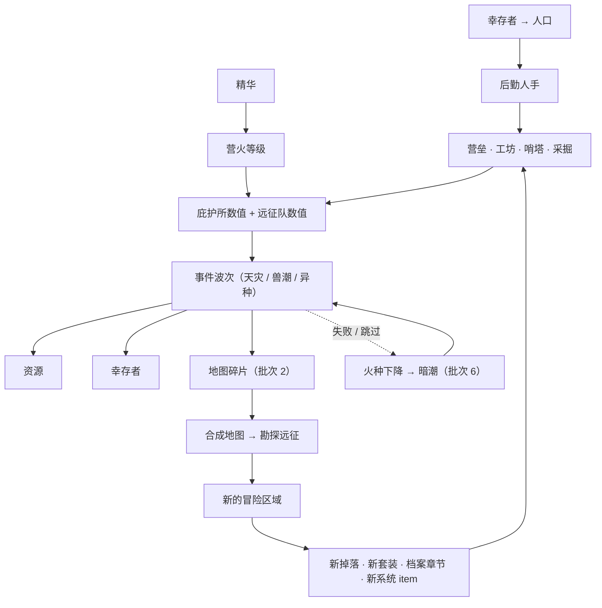

# 庇护所扩展方案

> 这份文档是【庇护所】这条线的**设计与实施依据**，和 `UI开发规范.md` 分工如下：
> - `UI开发规范.md` = **怎么写得不出 bug**（结构、约定、陷阱、勿回退清单）
> - 本文档 = **做什么、为什么这样做、按什么顺序做**（玩法设计、参数草案、路线图）
>
> 实现落地后，稳定的结构性约定（下标布局、奖励分发路径、修正层覆盖清单等）要**回写进 `UI开发规范.md`**，
> 本文档只保留设计意图与路线图。

---

## 0. 一句话概括

**庇护所不是【冒险】的配套，而是另一条并列的成长线，剧情上甚至更重要。**
玩法主轴是：**堆庇护所数值 → 扛住一波又一波事件 → 拿奖励（资源 / 幸存者 / 地图碎片）→ 解锁新的冒险区域 → 新的掉落与系统 → 再回来堆庇护所**。

---

## 1. 定位与命名

| 层级 | 名字 | 含义 |
| --- | --- | --- |
| 地点 | **庇护所**（Sanctuary） | 世界熄灭后最后有人聚集的地方 |
| 命脉 | **营火等级** | 庇护所的核心成长线，由**精华**升级；同时提升远征队与庇护所数值 |
| 势力 | **防线** | 由营火 + 工坊 + 营垒决定，用于抵御事件 |
| 外派 | **远征队** | 向外走的那部分人 |
| 人力 | **幸存者 → 人口** | 事件救下的人，转成后勤人手 |
| 刻度 | **波次** | 事件的可重复推进单位，3 次大事件为 1 波 |

**改名原则**：只改**显示文案**，`state.camp` / `.camp` / `.campWorkshop` 等**字段名一律保留**，存档格式零改动。
「营火」（那堆火本身）、「营垒」（工事名）保留原词。

---

## 2. 设计决定记录

| # | 决定 | 结论 |
| --- | --- | --- |
| 1 | 火种 / 人口是否进顶部资源条 | **不进**。营火等级放庇护所页顶部；人口作为一格 + 后勤人数来源展示 |
| 2 | 挑战的形态 | **归零 + 独占目标**（不是重打同一套内容） |
| 3 | 改名是否动存档字段 | **只改文案**，字段全保留 |
| 4 | 区域解锁方式 | **不局限于一种**：可组合的规则（主线 / 地图 / 事件 / Boss / 挑战 / 任意组合） |
| 5 | `state.workshop`（原「营火强化」）遗留 | ~~方案 A：做成正式的**营火等级**入口~~ → **后来整条撤掉了**，见 §4.3：该字段只剩物品栏容量一处引用 |
| 6 | 波次粒度 | **3 次大事件 = 1 波** |

> 5 和 6 是实施时采用的默认值（提出时未收到明确选择），如有异议直接改本文档与对应配置。

### 一条贯穿性的设计原则

> **不引入没有出口的资源。**
>
> 反面教材就在项目里：**精华（余烬碎片）** 能掉、能奖励、在资源条上显示，但**没有任何地方花掉它**。
> 所以：
> - 批次 1 让营火等级**消耗精华** ⇒ 顺便把这个洞补上；
> - **「火种」推迟到它有出口时（批次 2 的科技树）再引入** —— 否则只是再造一个精华；
> - 地图碎片在**合成功能就绪之前不发**。

---

## 3. 核心循环



每一环都必须有**出口**：数值有地方花、奖励有地方用、区域解锁条件看得见。

---

## 4. 系统设计

### 4.1 事件与波次

**现状问题**：`getNextCampChallenge()` 的判定是 `disasterWins < 1` / `tideWins < 1`，各打赢一次后永远 `return null`；
而 `campEventStats()` 里的成长公式（`180 + wins * 140`、`9 + wins * 5`）本来是给「可重复挑战」准备的，`wins` 永远停在 1 ⇒ **成长公式是死代码**。

**改法**：

```
wave = 当前波次（新增字段）
每 3 次大事件 = 1 波；第 3 次是「波末」
每波内交替：天灾 → 兽潮 → 异种（天灾/兽潮的变体，按 wave 决定名字与描述）
```

- `getNextCampChallenge()`：不再是「各一次就 null」，而是按 `wave` 与已通过次数算出**现在该打哪一场**
- `campEventStats()`：线性外推换成**分档非线性**（见 §8 参数草案），否则二十几波之后数值会失控
- 事件种类从「天灾 / 兽潮两个」扩成**三个**：新增 **异种**（`CAMP_EVENT.mutant = 3`），它是每波的收尾，数值在天灾与兽潮之上
- 事件定义表从「按下标排的数组」改成**按 kind 取的 Record** —— 中间留不留空位都不影响取值（`random` 走另一张表）
- **三者不做内容差异化**：`config/events.ts` 里只留 name / icon / desc，没有 advice，
  **也不进图鉴**（图鉴的分类页只收随机事件，显示名叫「随机事件」）；游戏内「当前威胁」卡片的标题
  直接显示事件名，不跳图鉴 —— 见 §8 末尾
- 波末额外奖励（幸存者 ×3 基准）

**新增 kind 的注意**：`CAMP_EVENT` 的取值是**存档字段**（`pendingKind`），只能**追加**，不能重排。
`campEventEntries`（图鉴条目表）也一样 —— 条目 id 是从它的下标算出来的，新条目**追加到末尾**。


### 4.2 奖励类型

`campEventStats().rewards` 现在只有 `{ gold, scrap, essence }`，扩成：

| 奖励 | 来源 | 用途 | 批次 |
| --- | --- | --- | --- |
| 资源（金币 / 废料 / 精华） | 所有事件 | 工坊 / 营火等级 / 研究 | 已有 |
| **幸存者** | 救援类事件、波末 | → 人口 → 后勤人手 | 1 |
| **地图碎片** | 波末、特定事件 | 凑齐 → 合成地图 → 解锁区域 | 2 |
| **系统 item** | 波末 | 解锁新工坊制造项 / 研究项 | 2 |
| 火种 | 硬仗 | 庇护所科技树货币 | 3+ |

### 4.3 营火等级 —— ❌ 已移除

曾经实现过「花**精华**提升营火等级，同时抬高远征队与庇护所」，**后来按需求整条撤掉了**：
`FIRE` 常量、四个函数（`getFireLevel` / `getFireCost` / `canUpgradeFire` / `upgradeFire`）、
庇护所页顶部那一块，全部删除。留下三条结论：

- **六个 getter 回到「基础 + 装备 / 套装 / 词条 / 工坊 / 营垒」**，不再有任何「全局等级」项。
  以后要加成长线请独立新增，别再借道 `state.workshop`
- **`state.workshop` 成了遗留字段**：新存档恒为 0、只有老存档带旧值，现在**只剩
  `getInventoryCapacity()`（`20 + 等级 × 2`）一处引用**。要不要彻底删掉 = 「老存档那几十格要不要留」，待定
- **精华重新变成「只进不出」** —— 它原来的唯一出口就是营火。要补出口时优先给它一个新的系统，
  而不是再造一个中间货币（§2 的原则）

### 4.4 地图碎片 → 地图 → 勘探远征（批次 2）

- 碎片做成**物品**（`category: 'resource'`，可堆叠）⇒ 自动进物品栏、自动进图鉴、可掉落可奖励
- 碎片**按区域分套**（每套 3~4 片），不同事件给不同套 ⇒ 逼玩家打**不同类型**的事件，而不是刷同一个
- 碎片带坐标，凑齐后在 UI 上**拼成一张地图**（纯 CSS grid，视觉爽点，零战斗成本）
- 合成「地图」后**不是直接解锁**，而是开启一次**勘探远征**（限时事件：派人去，成功才解锁）⇒ 多一层张力，
  也让「庇护所派人出去」这件事有画面
- 新增配置表：`mapSets`（区域 → 需要的碎片物品下标列表 + 拼图坐标）

### 4.5 区域解锁规则（批次 2）

现状：`Zone.unlockIndex` 单一通道，判定集中在 `isZoneUnlocked()`（**全游戏唯一判定点**）。

改成**可组合规则**，并且复用主线条件那套 `{ text, done }` 形状 —— 这样冒险页的锁定提示、图鉴的「进入条件」、
解锁公告三处**都自动学会显示**，不用各写一套：

```ts
/** 区域解锁规则：和主线条件同一套形状，渲染直接复用主线那套。 */
export type UnlockRule = { text: (state: GameState) => string; done: (state: GameState) => boolean };

export const unlockBy = {
  mainline: (index: number) => UnlockRule,
  map:      (mapId: number) => UnlockRule,
  event:    (kind: number, tier: number) => UnlockRule,
  boss:     (enemyId: number) => UnlockRule,
  challenge:(id: number) => UnlockRule,
  all:      (...rules: UnlockRule[]) => UnlockRule,
  any:      (...rules: UnlockRule[]) => UnlockRule
};
```

示例：

| 区域 | 规则 | 含义 |
| --- | --- | --- |
| 核心深井 | `mainline(5)` | 老路子 |
| 熔炉回廊 | `any(map(3), boss(ENEMY.coreTitan))` | 拼到地图 **或** 硬打过核心 Boss |
| 镜像城 | `all(challenge(2), map(5))` | 先通过挑战，再拼到地图 |

> **配套要求（不是可选项）**：每种规则都必须给出可读的 `text()`，否则玩家不知道该去哪。

### 4.6 Boss 区域（批次 3）

- `Zone` 加 `kind: 'combat' | 'boss' | 'camp'`、`spawnCooldown`（现在 `getSpawnCooldown()` 返回固定常量）、`difficulties`
- **难度不拉高数值**，而是换**掉落池**与**特性需求** ⇒ 独占装备是**收集轴**而不是**数值轴**，也不用重算整套平衡

| 难度 | 战斗数值 | 掉落 |
| --- | --- | --- |
| 常规 | ×1.0 | 通用掉落 |
| 强化 | ×1.25 | 通用 + 1 件独占 |
| 绝境 | ×1.6 | 通用 + 另 1 件独占（**取向不同，不是更强**） |

- 实现：`DropEntry` 加 `tier?: number`（缺省 = 所有难度都掉）。
  **安全性**：存档里 `discoveredDrops[enemyId]` 存的是**物品下标**，不是掉落条目下标
  ⇒ `dropTable` 的内部结构可以自由扩展，**不影响存档**（`zones.ts` 顶部「键顺序不能动」只约束怪物表/区域表本身）。
- Boss 可简单互殴，也可以带阶段（见 §4.8）

### 4.7 特性（trait）检查（批次 3）

「有的 Boss 需要某装备才能有效扛住」的最小实现 —— 两个字段 + 两处伤害计算：

```ts
interface Item  { ...; traits?: string[]; }   // 装备特性：insulated 隔热 / piercing 破甲 / sonar 声呐
interface Enemy { ...;
  requires?: string;   // 玩家没有这个特性时，受到的伤害 ×2.5（「扛不住」）
  immune?: string;     // 玩家没有这个特性时，造成的伤害 ÷3（「打不动」）
}
```

- 检查点：`enemyAttack()` 与 `playerAttack()`，各加一行倍率
- **平衡护栏**：特性装备是**可获取的替换件**（同档数值、不同标签）⇒ 难度中性
- 显示：Boss 卡片写「特性需求：隔热装备」+ 已满足/未满足状态点（复用 `.requirement`）；
  图鉴的 Boss 页同步写明 ⇒ 「打不过」是可查的，不是玄学

### 4.8 挂起与弹窗输入（批次 3）

**代码里已有现成模式** —— 庇护所随机事件的「挂起等待响应」：

```ts
target.camp.pendingKind = CAMP_EVENT.random;
target.camp.pendingId = id;
target.camp.pendingExpires = Date.now() + PENDING_EVENT_TIMEOUT * 1000;
```

把它**通用化**（**新增** `state.prompt`，老字段 `camp.pending*` 保持不动以免破坏存档），Boss 就能在中途拦住玩家：

```ts
Enemy.phases?: [
  { hpPct: .75, prompt: { mode: 'choice', ... } },   // 选择：硬扛 / 绕后 / 撤退
  { hpPct: .40, prompt: { mode: 'input',  ... } }    // 输入：从战斗日志里读出的信号序列
]
```

`input` 型的公平性：**线索就写在战斗日志里**（Boss 报出一串信号），玩家在日志中找出来填进去
⇒ 把「读日志」本身变成玩法，而不是考记忆力。

**放置游戏的护栏（必须遵守）**：
- 只在 Boss 区域触发
- 每场战斗最多 1~2 次
- 超时自动按**最坏结果**处理
- **设置页可整体关闭**（关掉 = 一律自动按「不回答」处理）

### 4.9 远征档案的【挑战】（批次 4）

**形态**：归零 + 独占目标。

- 目标复用主线条件那套 `{ text, done }` ⇒ 挑战页直接复用 `story.ts` 的条件渲染，不另写一套
- 「归零」的实现：集中一层 `challengeFactor()`，套在所有派生数值外面
- **必须逐个覆盖**：
  `getPlayerAttack` / `getPlayerDefense` / `getPlayerMaxHp` / `getPlayerRegen` / `getPlayerAttackInterval`
  + `getCampMaxHp` / `getCampAttack` / `getCampDefense` / `getCampRegen`
  + `getLogisticsTotal` + `getWorkshopRate`
  —— **漏一个就会出现「挑战里还能作弊」**
- 结果记进**新增字段**（不动老字段），并给成就 / 图鉴条目 / 专属物品

| 挑战 | 限制 | 玩法变化 |
| --- | --- | --- |
| 赤手 | 装备与词条全部失效 | 逼你靠庇护所数值打 |
| 孤火 | 庇护所加成归零 | 必须在挑战内靠事件奖励重新堆起来 |
| 静默 | 随机事件不能跳过、没有前兆 | 不能挑食 |
| 无声 | 后勤人数恒为 1 | 人手分配变成真正的取舍 |
| 焦土 | 生命恢复为 0 | 每次战斗都要算 |
| 盲行 | 看不到敌人数值，只能读日志 | 回到「读文字」的原始体验 |
| 限时 | 必须在 N 次事件内达成目标 | 节奏压力 |

**为什么这块性价比最高**：给已通关玩家准备、**复用现有全部系统**、只换一组参数。

### 4.10 多元宇宙与小世界（批次 5）

**世界观**：击败核心深处的新 Boss → 激活余烬核心 → **时空乱流** → 后续区域进入多个小世界。

- `Zone` 加 `world?: number`，新增 `worlds` 配置表（名字 / 图标 / 主题色 / 描述）
- 每个小世界**自带一套装备**（现有 `setTable` 本来就是「一套一区域」）
- 远征档案的章节结构**已经是两级**（chapter → nodes），第二章占位已写好（`story.ts` 的 `chapters`）⇒ 加世界章节不用改结构
- 图鉴可按世界分组（`ITEM_PAGE` 那套分类页是现成模式）

| 小世界 | 风格 | 专属机制 |
| --- | --- | --- |
| 锈红沙漠 | 蝗灾式 | 单只很弱，但每次刷一片 |
| 镜像城 | 镜像数值 | 怪物复制玩家属性 ⇒ 逼你别一味堆攻 |
| 无声之海 | 弹窗 + 输入 | Boss 全靠阶段弹窗 |
| 齿轮深渊 | 特性检查 | 每只怪都有 `requires` / `immune` |
| 静谧森林 | 无战斗 | 只有资源交换与时间推进 |
| 熔炉回廊 | 只出强化道具 | 掉落池被换成纯强化材料 |

---

## 5. 实施路线图

| 批次 | 内容 | 状态 |
| --- | --- | --- |
| **0 地基** | 改名【庇护所】（只改文案）+ `UI开发规范.md` 补 §7.16 | **已完成** |
| **1 立起来** | 事件波次化（新增异种）+ 奖励加「幸存者」+ 人口进后勤 + 庇护所页展示 | **已完成**（营火等级曾一并做过，随后被撤掉，见 §4.3） |
| **2 向外扩** | 地图碎片 / 地图 / 勘探远征 + 解锁规则多样化 + 一张新区域 + **10 只怪重新校准** | 待做 |
| **3 Boss** | Boss 区域（难度 / 独占掉落 / 特性）+ `state.prompt` 通用化 + 阶段弹窗输入 | 待做 |
| **4 通关内容** | 远征档案【挑战】（归零 + 独占目标） | 待做 |
| **5 世界扩张** | 多元宇宙：世界表 + **一个小世界打通全链路** | 待做 |
| **6 加厚度** | 前兆 / 守望塔 / 多阶段 / 交涉 / 暗潮 / 口粮 / 拼图 UI | 待做 |

**批次 5 的硬性约束**：**先做一个小世界打通全链路**（区域 + 5 只怪 + 套装 + 掉落 + 图鉴 + 章节），
验证完再做第二个。每加一个区域的工作量是**乘数级**的，不要一次铺开。

---

## 6. 技术落点

| 要做的事 | 挂在哪 | 新增字段 | 风险 |
| --- | --- | --- | --- |
| 改名 | `index.html` 导航 + 全部文案 | 无 | 文案清扫量大，**单独提交** |
| 营火等级 | `state.workshop`（复用）+ 庇护所页 | 无 | 做完要重新校准 10 只怪 |
| 事件波次 | `getNextCampChallenge()` + `campEventStats()` | `camp.wave` | 小 |
| 奖励多样化 | `campEventStats().rewards` + `finishCampBattle()` | — | 小 |
| 人口进后勤 | `getLogisticsTotal()` + 工坊页来源拆分 | `camp.population` | 小 |
| 碎片 / 地图 | 新物品 + `mapSets` 配置表 | `camp.maps` | 中 |
| 区域解锁 | `isZoneUnlocked()`（唯一判定点）+ `Zone.unlock` | — | 小，但要配 `text()` |
| Boss 区域 | `Zone.kind / spawnCooldown / difficulties` + `DropEntry.tier` | — | 中 |
| 特性检查 | `enemyAttack()` / `playerAttack()` + `Item.traits` / `Enemy.requires` | — | 小 |
| 弹窗输入 | 新增 `state.prompt`（老 `camp.pending*` 不动） | `state.prompt` | 中 |
| 挑战 | 集中 `challengeFactor()` | `camp.challengeCleared` | 中，覆盖清单见 §4.9 |

### 三条硬约束

1. **下标不能动**：怪物表 / 区域表 / 物品表都是按下标存进存档的（`zones.ts` 顶部 ⚠️ 已写明）。
   新怪物、新区域、新物品**一律追加末尾**。
2. **`CAMP_EVENT` 的取值只能追加**（它是 `pendingKind` 的存档值）。
3. **老字段不移动、不重命名**；要新概念就**新增**字段。新增字段不动 `SAVE_VERSION`（走 `rebuildState` 的逐字段校验）。

---

## 7. 风险与护栏

| 风险 | 护栏 |
| --- | --- |
| Boss 难度 × 独占掉落导致物品 / 图鉴爆炸 | 每个 Boss **只加 1~2 件**独占，且是「不同取向」不是「更强」 |
| 弹窗 + 输入破坏放置体验 | 仅 Boss 区域、每场 ≤2 次、超时按最坏结果、设置页可整体关闭 |
| 小世界数量膨胀 | 先做一个打通全链路（见 §5） |
| 解锁方式多样化后玩家不知道去哪 | 每种规则必须给可读 `text()`，三处显示 |
| 挑战「归零」漏掉某个 getter | 用 §4.9 的覆盖清单逐个勾 |
| 新增资源没有出口 | §2 的「不引入没有出口的资源」原则 |
| 数值失控 | §8 的参数**都要标注「待调」**，校准前不要写死结论 |

---

## 8. 参数草案（全部待调）

> ⚠️ 这一节的数字都是**按现有基准推的初值，没有经过实际游玩验证**。
> 调之前先读 `config/zones.ts` 顶部那段「数值设计的三条约束」。

**营火等级 —— 已移除**，参数不再适用。但那份**校准参考仍然有效**，它指出了当前的真实缺口：

> `zones.ts` 注释里「设计」那一列是按「套装齐 + 营火 N 级」算的，而营火现在不存在了 ⇒
> **余烬矿脉 / 核心深井这两档怪是按一条已经删掉的成长线设计的**。
> 第 2 批要做的那次「10 只怪重新校准」，就是把这个缺口补回来 ——
> 要么按「实际」那一列降怪，要么给玩家补一条等价的成长线。

**波次强度**（`wave` 从 1 起）

| 项 | 现值 |
| --- | --- |
| 事件生命 / 攻击 | 第 1 波基准值 × `CAMP_WAVE.growth^(wave-1)`，**growth = 1.35** |
| 事件防御 | 基准值 `+ (wave-1) × CAMP_WAVE.defenseStep`（**线性**，见下） |
| 出手间隔 | 前 3 波不变，之后每波 `-0.03`（下限 0.7） |
| 奖励 | 基准值 × `scale^CAMP_WAVE.rewardDamp`（`rewardDamp = 0.5`） |
| 波内结构 | 天灾 → 兽潮 → 异种（异种是波末） |

> **为什么这次是等比**：这是**刻意**要的那堵墙 —— 庇护所侧是线性成长（工坊 / 营垒的造价与工时随级数
> 线性涨、没有上限），等比迟早在某个波次追上。于是「能推到第几波」成为长期目标，
> 也顺手掐掉了「一路平推」导致的进度失控。
>
> **为什么防御走线性**：防御进的是减法（伤害 = 攻击 − 防御，最低 1 点）。跟着等比会让伤害迅速压到 1 点，
> 把「打不过」变成「磨不完」—— 那是另一种崩坏。
>
> **奖励只跟涨平方根那一档**：全额跟涨会让金币 / 废料 / 精华的数值爆炸，完全不跟涨又没人愿意往上推。
>
> **`growth` 决定墙在哪**（庇护所固定为攻 93 / 防 114 / 血 1575 时的实测）：
>
> | growth | 可清剿场次 | 推到约 |
> | --- | --- | --- |
> | ×1.12 | 62 | 第 21 波 |
> | ×1.15 | 50 | 第 17 波 |
> | ×1.20 | 40 | 第 14 波 |
> | ×1.25 | 32 | 第 11 波 |
> | ×1.30 | 29 | 第 10 波 |
> | **×1.35**（现值） | 25 | 第 9 波 |
> | ×1.45 | 20 | 第 7 波 |
> | ×1.60 | 17 | 第 6 波 |

**三种大事件不进图鉴**：它们只差属性，所以 `config/events.ts` 里只留 name / icon / desc（没有 advice），
`campEventEntries` **只收随机事件** —— 图鉴那个分类页就叫「随机事件」。
（曾经试过给三者合并一页「威胁」，后来按需求撤掉了：Threat 只看属性，不需要图鉴页面。）

**人口**

| 项 | 草案 |
| --- | --- |
| 每人手 | 3 人 ⇒ `getLogisticsTotal` 加 `⌊人口 / 3⌋` |
| 来源 | 救援类事件、波末 |
| 展示 | 庇护所页一格 + 工坊页「待命 X / 总数 Y（主线 N / 胜场 N / 人口 N）」 |

---

## 9. 待定问题

| # | 问题 | 当前假设 |
| --- | --- | --- |
| 1 | ~~营火等级用精华还是新资源~~ | **作废**：营火已整条移除（§4.3），精华暂时又没有出口了 |
| 2 | 波次粒度 | **3 次大事件 = 1 波** |
| 3 | ~~营火等级上限与曲线~~ | **作废**：同上 |
| 4 | 波次强度曲线 | **已定：等比 `×1.35^(wave-1)`**（防御线性、奖励跟涨平方根），见 §8 |
| 5 | 「异种」是独立 kind 还是天灾/兽潮的档位 | **独立 kind**（`CAMP_EVENT.mutant = 3`，追加在末尾不影响老取值） |
| 6 | 地图碎片每套几片 | 3~4 片（批次 2 定） |
| 7 | 挑战的具体数量与顺序 | 批次 4 定 |
